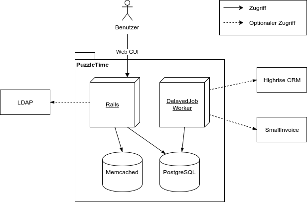

## Kontextabgrenzung

### Interne Systeme

**Rails**: Web Applikation, welche die Anfragen von Web Clients entgegen nimmt und diese beantwortet. 

**DelayedJob**: Ein oder mehrere Worker Prozesse, welche die Delayed::Jobs abarbeiten. 
Die Jobs werden vom Rails Prozess in der Datenbank persistiert und zu gegebenen Zeitpunkt 
von Delayed::Jobs wieder geladen und ausgeführt. Hauptsächlich zur Synchronisation mit
CRM und Invoicing Diensten verwendet.

**PostgreSQL**: Relationale Datenbank für alle persistenten Daten.

**Memcached**: In-Memory Store, welcher zum Caching bestimmter Daten,
 unter anderem den Session Informationen, verwendet wird.

Es werden keine Daten auf dem Dateisystem abgelegt.

### Externe Schnittstellen

**LDAP**: Erlaubt die Authentisierung über LDAP. Falls kein LDAP konfiguriert ist, kann über ein 
 Applikationsspezifisches Passwort eingeloggt werden.

**Highrise**: Synchronisiert Aufträge, Kunden und deren Kontakte aus
 [Highrise](https://highrisehq.com) (falls konfiguriert). 
 Änderungen im PuzzleTime werden nicht im Highrise aktualisiert. 
 Theoretisch kann auch ein Interface zu einem anderen CRM Service implementiert werden.
 
**SmallInvoice**: Rechnungsdaten mit allen benötigten Daten (Kunden, Kontakte, Rechnungsadressen)
 werden an [SmallInvoice](https://www.smallinvoice.ch) geschickt, um dort Rechnungen zu erstellen
 und zu verwalten.
 Die Totalbeträge und Status der Rechnungen werden zurück ins PuzzleTime übernommen, 
 Änderungen an den anderen Modellen in SmallInvoice werden bei der nächsten Synchronisation 
 überschrieben. 
 Falls SmallInvoice nicht konfiguriert ist, können zwar Rechnungsinstanzen erstellt 
 werden, es besteht aber keine weitere Funktionalität zum Drucken, Verwalten von Zahlungseingängen usw.
 Theoretisch kann auch ein Interface zu einem anderen Invoicing Service implementiert werden.