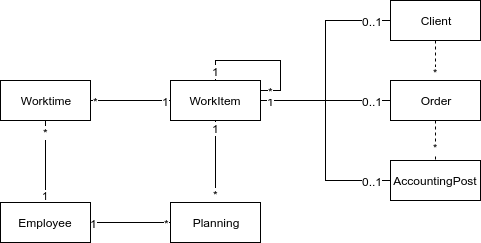

## Bausteinsicht

Diese Sicht zeigt die Hauptmodelle in PuzzleTime. Ein vollständiges und aktuelles Datenbankmodell
kann mit dem Befehl `rake erd` generiert werden.

**`Worktime`**: Die Arbeitszeit ist das zentrale Objekt der Zeiterfassung. Es gehört immer zu einem 
 Mitarbeiter und kommt in zwei Ausprägungen, welche mittels 
 [Single Table Inheritance](http://api.rubyonrails.org/classes/ActiveRecord/Inheritance.html) 
 implementiert sind: `Ordertime` für Arbeitszeiten, welche zu einem `WorkItem` gehören, 
 und `Absencetime`, welche Abwesenheiten kennzeichnen.
 
**`WorkItem`**: Das `WorkItem` bildet die gesamte Baumstruktur ab, in welcher Kunden, Aufträge 
 und Buchungspositionen organisiert sind. Es beinhaltet ausschliesslich Informationen der 
 Struktur (wie Name, Pfad, usw) und ist in der Regel einem der obigen Elemente zugeordnet.
 Das Modell erlaubt `WorkItems` ohne zugeordnetes Element, das aktuelle User Interface ermöglicht
 jedoch nur das Erstellen von Kategorien, welche optional zwischen Kunde und Auftrag angeordnet sind.
 Die kleinste Strukturierung ist somit "Kunde - Auftrag/Buchungsposition", die grösste 
 "Kunde - Kategorie - Auftrag - Buchungsposition". Arbeitszeiten und Planungen können
 ausschliesslich auf dem jeweils untersten `WorkItem` (Blatt) erfasst werden, damit die Werte
 immer einer Buchungsposition zugeordnet werden können.

**`Client`**: Der Kunde ist das oberste Element der `WorkItem` Struktur. 
Er beinhaltet Kontakte und Rechnungsadressen.

**`Order`**: Der Auftrag ist das zentrale Element. Hier wird der Projektablauf verwaltet,
Kennzahlen rapportiert, Rechnungen gestellt und vieles mehr.

**`AccountingPost`**: Die Buchungsposition definiert das Budget und den Stundensatz und
 ermöglicht Vorgaben für die Zeiterfassung. Sie kann auf demselben `WorkItem` wie der Auftrag
 sein oder, um mehrere Positionen auf einem Auftrag zu halten, auf einem darunter.

**`Employee`**: Der Mitarbeiter sind gleichzeitig die Benutzenden von PuzzleTime.
 Arbeitszeiten und Planungen sind immer ihnen zugeordnet. Zur Berechnung von Ferien, Überzeit usw
 haben Mitarbeiter eine oder mehrere Anstellungen. Über das `management` Flag erhält ein
 Mitarbeiter die vollständigen Zugriffsberechtigungen.

**`Planning`**: Die Planung erlaubt die Verteilung der Mitarbeiter auf Buchungspositionen 
 (eigentlich Blatt `WorkItems` ) in der Zukunft und bildet so die Basis für den Umsatzforecast.
